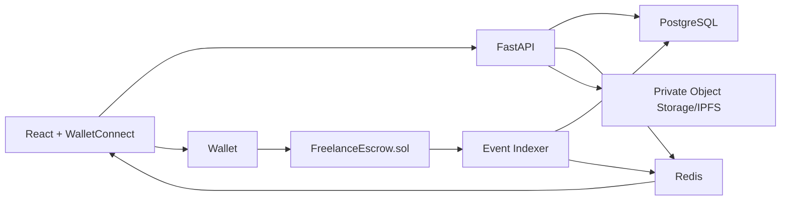

# Arquitetura do MVP

## Visao geral

O MVP e um marketplace freelance com descoberta por swipe e escrow em USDC na Base. A camada on-chain atua apenas como infraestrutura de confianca: custodia programatica, maquina de estados, liquidacao financeira e hashes de integridade. Toda experiencia rica de produto permanece off-chain: chat, arquivos, recomendacao, swipe, moderacao, PII e detalhes privados de reputacao.

## Limite on-chain/off-chain

| Dado ou funcionalidade | Local | Motivo |
| --- | --- | --- |
| Job ID | On-chain | Vinculo deterministico entre contrato e metadados off-chain. |
| Carteiras do cliente e freelancer | On-chain | Necessario para custodia e pagamentos. |
| Valores em USDC e milestones | On-chain | Execucao financeira deterministica. |
| Estado de milestones e disputas | On-chain | Controle de liberacao, timeout e resolucao. |
| Hashes de evidencias | On-chain | Integridade e auditoria sem expor conteudo privado. |
| Chat, arquivos e entregas | Off-chain | Dados volumosos e sensiveis. |
| PII e perfis completos | Off-chain | LGPD/GDPR e controle de exposicao. |
| Swipe e recomendacao | Off-chain | Alta frequencia, baixo valor de consenso. |
| Reviews textuais | Off-chain | Moderacao e edicao sem gas. |

## Componentes



## Fluxo de job

1. O cliente cria um job off-chain com titulo, descricao, arquivos privados, criterios de aceite e milestones.
2. O backend cria o `jobId` e prepara a transacao `createJob(...)`.
3. O cliente assina e envia `createJob(...)` para registrar partes, token e valores.
4. O cliente aprova USDC e chama `fundJob(...)`.
5. O freelancer envia a entrega off-chain e registra `submitMilestone(...)` com `evidenceHash`.
6. O cliente aprova, pede revisao ou abre disputa.
7. Se o cliente ficar inativo por 7 dias, qualquer parte pode chamar `releaseAfterTimeout(...)`.
8. Se houver disputa, um arbitro humano analisa evidencias off-chain e chama `resolveDispute(...)`.

## Fonte da verdade

O PostgreSQL e uma projecao operacional. A verdade financeira e reputacional vem dos eventos do contrato. O indexer grava eventos com chave unica:

```text
(chain_id, contract_address, block_number, tx_hash, log_index)
```

Com isso, a base pode ser reconstruida cronologicamente a partir da blockchain.

## Reputacao verificavel

As metricas publicas devem ser agregadas, nao revelar parceiros e valores exatos:

- Trabalhos concluidos sem disputa pendente.
- Volume verificado em faixas publicas.
- Taxa de aprovacao direta.
- Taxa de disputa.
- Recorrencia de clientes.

Dados exatos ficam permissionados na camada off-chain e podem ser liberados pelo freelancer para clientes especificos.

## Arbitragem

O contrato nao julga qualidade tecnica, estetica ou aderencia subjetiva. A disputa usa fluxo humano estruturado:

1. Uma parte abre disputa no contrato.
2. As partes enviam evidencias para workspace privado.
3. O backend consolida as evidencias e calcula hash criptografico.
4. O arbitro verifica o conteudo off-chain.
5. O arbitro chama `resolveDispute(...)` definindo a divisao em BPS.

## Seguranca

- O administrador nao possui funcao para sacar fundos de usuarios.
- `pause()` paralisa novas acoes, mas nao cria poder de saque administrativo.
- Cada job respeita `maxJobAmount`.
- Transferencias usam `SafeERC20`.
- Funcoes financeiras usam `nonReentrant`.
- Splits usam BPS com limite de 10.000.
- Cancelamento mutuo exige assinatura EIP-712 de cliente e freelancer.

## Evolucao

A arquitetura mantem fronteiras para uma fase futura com ERC-4337:

- Servico de wallet isolado no frontend.
- Backend preparado para montar user operations.
- Contrato de escrow independente do modo de autenticacao.
- Possibilidade futura de paymasters e batched actions.
